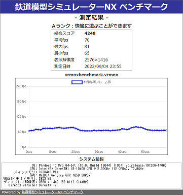

# VRMNXベンチマーク
## 概要
「VRMNXベンチマーク」は「[鉄道模型シミュレーターNX](http://www.imagic.co.jp/hobby/products/vrmnx/ "鉄道模型シミュレーターNX")」（VRMNX）で動作する非公式ベンチマークツールです。  
フレームイベントをカウントすることで描画速度（FPS）を計測し、測定結果をHTMLファイルで出力します。  
サンプルレイアウトは無料のスターターキットで動作します。  


## 使い方
「Code」→「Download ZIP」からダウンロードしたzipファイルを任意のフォルダに展開してください。  
動作に必要なファイルは以下の通りです。  

```
vrmnxbenchmark.vrmnx         # サンプルレイアウト
vrmnxbenchmark.py            # ベンチマークモジュール
vrmnxbenchmark_template.html # ベンチマーク測定結果出力テンプレート
```

レイアウターウィンドウを最大にしてサンプルレイアウトを起動します。  
「運転」を押すと自動的に測定が開始されます。  
ImGuiウィンドウには測定までの残り時間とスコア情報が表示されます。  


測定完了までは何も操作しないでください。  
測定途中でビュワーを終了した場合、結果は表示されません。  
測定が完了するとレイアウトファイルと同じフォルダに測定結果ファイル「vrmnxbenchmark_yyyymmdd_hhmm.html」が作成され、デフォルトブラウザで自動的に開きます。  
測定が完了したら「ESC」キーを押してビュワーを終了します。（そのまま遊ぶこともできます）  


## 測定結果の見方



| 項目 | 説明 |
| ---- | ---- |
|ランク|ベンチマークを実行したレイアウトの快適さを平均FPSを元にD～SSランクで示します。<br/>Aランク以上が快適に遊べる目安です。|
|総合スコア|フレームイベントの総合回数です。|
|平均FPS   |総合スコアを実行時間(標準は60秒)で割った値です。|
|最大FPS   |1秒間で最も多い描画回数です。|
|最小FPS   |1秒間で最も少ない描画回数です。|
|表示解像度|VRMNXのウィンドウサイズです。<br/>総合スコアに大きく影響するため、同じサイズで比較してください。|
|測定日時  |ファイル出力した日時を記録します。|
|OS        |OSのバージョンを示します。Windows10 以上が必要です。|
|CPU       |CPUを示します。2CPU(コア)以上、2.0GHz以上が最低目安です。|
|メインメモリ|メモリ容量を示します。8GB以上が目安です。<br/>展開できるレイアウトサイズやパーツ数に影響します。|
|GPU       |ビデオカードを示します。「GeForce」もしくは「Radeon」が必要です。|
|VRAM      |ビデオメモリを示します。2GB以上が目安です。<br/>展開できるレイアウトサイズやパーツ数に影響します。|
|ディスプレイ解像度|数字が大きいほど細かな描画が可能ですが、GPUの性能が必要です。|
|DirextX Version|DirextXの実行バージョンを示します。「DirextX 12」以上が必要です。|


## 注意事項
- 「鉄道模型シミュレーターNX ベンチマーク」のスコアはツールが実行されたレイアウトに対するスコアです。「鉄道模型シミュレーターNX」のベンチマークや性能指標を示すものではありません。
- 表示解像度によりスコアが大きく異なります。正確に測定する場合は実際のウィンドウサイズで実行してください。
- ベンチマーク実行時は「レイアウターツール」→「ビュー」→「フレーム同期」のチェックを外してください。「フレーム同期」のチェックを外すと上限制限が解除されます。通常時にVRMNXで遊ぶ際は余計な演算を行わないように「フレーム同期」のチェックを入れることを推奨します。  


## レイアウトへの組み込み方法

「VRMNXベンチマーク」は任意のレイアウトに組み込むことができます。  
組み込む対象のレイアウトファイルと同じフォルダ階層に「vrmnxbenchmark.py」ファイルと「vrmnxbenchmark_template.html」ファイルを配置してください。  

フォルダ構成例：
```
C:\VRMNX
├ vrmnxbenchmark.py
├ vrmnxbenchmark_template.html
└ VRMNXレイアウトファイル.vrmnx
```

対象レイアウトのレイアウトスクリプトに以下の★内容を追記します。  

```py
#LAYOUT
import vrmapi
import vrmnxbenchmark # ★インポート

def vrmevent(obj,ev,param):
    vrmnxbenchmark.vrmevent(obj,ev,param) # ★メイン処理
    if ev == 'init':
        dummy = 1
    elif ev == 'broadcast':
        dummy = 1
    elif ev == 'timer':
        dummy = 1
    elif ev == 'time':
        dummy = 1
    elif ev == 'after':
        dummy = 1
    elif ev == 'frame':
        dummy = 1
    elif ev == 'keydown':
        dummy = 1
```

モジュール読み込みに成功するとビュワー起動時のスクリプトログに以下が表示されます。

```
import VRMNXベンチマーク Ver.x.x
```

## FAQ
- システム情報が「N/A」で表示される
  - システム情報は「DirextX診断ツール」から取得していますが、稀にファイル作成できないケースを確認しています。その場合、コマンドプロンプトから「`dxdiag /t`」コマンドを実行し、カレントディレクトリに出力された「dxdiag.txt」ファイルを上記フォルダに入れてからビュワー（ベンチマーク）を実行してください。
